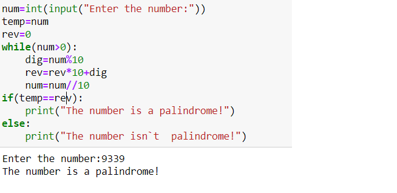

# Identify Palindrome:
### For a given positive number num,identify the palindrome fromed by performing the following oprations:-
        *Add num its reverse
        *check Wheter the sum is palindrome or not.if not,add the sum and its reverse and repeat the process untill a palindrome is obtained.
***
### For Example:
### IF original integer is 195,we get 9339 as the resulting palindrome after the fourth addition:
        195+591=786
        786+687=1473
        1473+3741=5214
        5241+4125=9339
***
### Input format:
### Read num from the standard input stram.
### Output fromat:
### print the palindrome calculated to the standard output stream.
### Sample input:
### Enter any number:1123
### Sample Output:
### Palindrome no.=4334
### Sample input:
### Enter any number:126
### Sample Output:
### Palindrome no.=747

